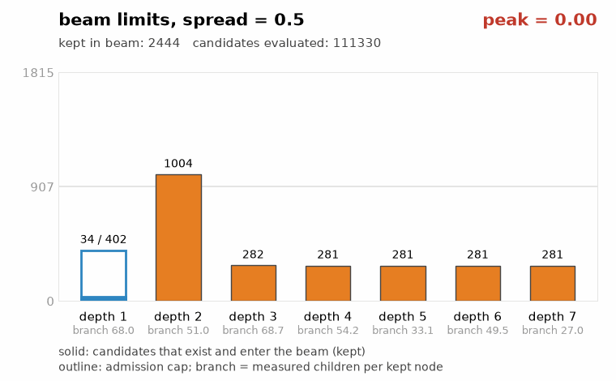
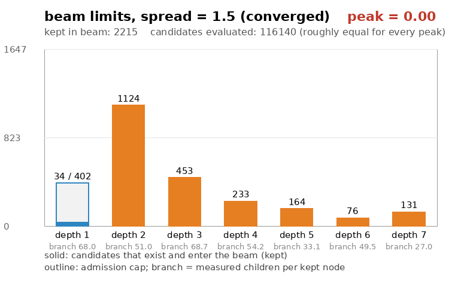
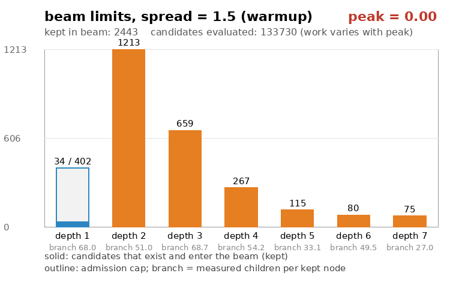

# Beam search

## Glossary

Shared engine vocabulary (board, roof, placement, evaluation, depth, horizon, hold, status, search budget) is defined in the [Glossary](Glossary). This page adds what is specific to the search:

| Term | Meaning |
|------|---------|
| Breadth-first search (BFS) | Exploring a search tree one depth at a time: every position at depth *d* is expanded before any position at depth *d + 1*. |
| Beam search | A breadth-first search that cannot afford every position, so each depth keeps only a fixed number of survivors, the beam, and discards the rest. |
| Beam limit | The number of survivors allowed at one depth. Here it is a per-depth schedule computed before the search starts. |
| Search width | The beam size the iteration budget translates into; the first layer's cap and the deeper layers' budget scale from it. |
| Frontier | The set of survivors at the depth currently being expanded. |
| Candidate | One placement along one path: the board it produces, its status, and a link back to the first placement of its path. |
| Iterative widening | Growing the beam gradually: start narrow, keep widening as long as budget remains, and stop when the budget runs out. The upstream engine haipa is based on works this way. |
| Branching factor | How many children an average kept position produces, counted as the placements scored from it. |
| Learned branching estimate | A running average of the observed branching factor at each depth, carried between moves and used to balance the schedule. |
| Tie-break | The rule that decides between equally good candidates. Here it is generation order, which makes the whole search deterministic. |

## Overview

The engine is based on [tetris_ai_runner](https://github.com/TetrisAI/tetris_ai_runner), and the search is the part that changed most. The upstream engine is an anytime search driven by the clock: it starts with a narrow beam and *iteratively widens*, expanding a little more on every pass until the time limit expires. The result is a beam shape that comes out of however many widening steps fit in the budget, and a search whose outcome can vary with machine load.

haipa keeps the widening idea but removes the loop. Given an iteration budget *n*, it **pre-computes the entire beam limit schedule** for every depth, then runs a single breadth-first pass under those limits. The pre-computed schedule imitates the shape that iterative widening settles on, while the search itself becomes one deterministic sweep with no time measurement and no re-expansion of already-explored positions.

## One pass, layer by layer

The search expands the tree breadth-first, one placement per depth, where the placements available to each candidate are exactly the landings the [movegen](<../Search/Movegen>) reports:

```python
def search(board, horizon, limits):
    frontier = keep(first_placements(board), limits[0])
    best = best_of(frontier)
    if all_agree_on_first_move(frontier):
        return frontier[0].first_move
    for depth in range(1, horizon):
        children = expand_and_score(frontier)
        if not children:
            break
        best = best_of(children)
        frontier = keep(children, limits[depth])
        if all_agree_on_first_move(frontier):
            break
    return best.first_move
```

The branch split over sampled futures sits outside this loop: it runs once per branch, continuing from a shared frontier (see [Fake next and branching](<Fake next and branching>)).

Each surviving candidate remembers the *first* placement of its path (including whether it was a hold swap), so no matter how deep the search goes, the answer is always one concrete move for the current piece.

Every child is scored when it is generated. Scoring itself is where the [transposition table](<Transposition Table>) lives: the board evaluation is cached, and the context-dependent part of the status is applied per candidate.

## The beam limit schedule

The schedule is the heart of the design. Given the iteration budget *n* and the horizon, it decides how many survivors each depth may keep. Three ingredients shape it:

1. **A total budget.** The first layer of placements is capped at twice the search width, a size that follows from the iteration budget; the remaining budget across the deeper layers scales with the same width times the horizon. The first layer sits outside the profile on purpose. It holds every legal placement of the current piece, about 34 in the shipped ruleset, all of them cheap to evaluate and all of them directly relevant, since one of them is the move the engine will actually play. The cap is set high enough to never bind, so no real move is discarded before it has been judged, and the Gaussian profile only decides how the much larger deeper layers share the rest of the budget.
2. **A Gaussian depth profile.** The budget is not spread evenly. Its distribution across depths follows a Gaussian centered at a configurable fraction of the horizon, with a configurable spread and a floor of 5 percent of the dome's peak: depths near the center of the horizon keep most of the survivors, and both ends get little on purpose. Early depths matter little because they are cheap to redo, their boards' evaluations already sitting in the transposition table, and the last depths matter little because there is no time left to use what they found.
3. **Branching-factor balancing.** The dome shapes the *evaluation work* of each depth, not the survivor count directly. The engine keeps a learned branching estimate, a running average of how many children each depth actually produced in past searches, and divides each depth's share by it: a depth that branches harder gets a smaller survivor cap, so that the number of scored children per depth follows the dome. Survivor counts therefore move opposite to branching, and the cap sequence is on purpose not smooth even when the dome is. The estimates reset when a new game starts.

The animations below sweep the peak across the full horizon in the settled state (horizon 7, iteration budget 200, and the per-depth branching estimates settled at the values measured from the engine: 68.0, 51.0, 68.7, 54.2, 33.1, 49.5, and 27.0 children per kept node at depths 1 through 6). Solid is what actually exists and enters the beam, the outline is the cap, and the blue bar is the fixed first-layer cap, which at this budget exceeds the roughly 34 possible first placements and never binds. With a narrow spread the bump is one or two depths wide; with a wider spread the survivors cover most of the horizon, while survivor counts still move opposite to branching in both:





Dividing by branching has a property worth knowing: the total number of candidates evaluated per decision barely changes with the peak and the spread (within 0.1 percent across the full sweep on the measured profile above).

The branching estimates start at 1, so the first deep searches of every game run the pure dome shape before anything has been learned, and the estimates settle within a few searches (each search updates every depth it actually expands). During that warmup the equal-work property does not hold, since there is nothing to divide by; the animation below shows the same sweep before any estimate has been learned:



The two profile knobs (the peak position and the spread) come from the AI's configuration, so changing the AI's configuration also changes where the search concentrates its work.

## Keeping the survivors

Children compete for the frontier slots in a priority queue that never grows past the beam limit:

```python
def keep(child):
    if len(frontier) < limit:
        push(child)
    elif better(child, worst(frontier)):
        replace_worst(frontier, child)
    # otherwise the child is discarded
```

Ranking compares candidates by status, with ties broken by generation order: the earlier-generated candidate wins. Both rules together make the search fully deterministic, which matters because matches must be reproducible.

Discarding a candidate is the beam search trade-off, and it is the one place where the search can be wrong: a placement pruned at depth 2 is never reconsidered, even if it would have led somewhere better. The schedule's job is to make that loss unlikely where it matters.

## Memory

The search's memory has a hard limit, and the limit is the schedule itself. A layer never holds more candidates than its beam limit, so the number of live candidates at any moment is at most the sum of the caps across the horizon. Each candidate records the board it produced, its status, the pieces still to come, and a link to the first placement of its path. No search tree is kept; a pruned candidate is dropped on the spot and can only reappear through another path.


The figure shows what that means across the whole tree: the first layer survives as the answer, the last layer decides which answer wins, and the interior depths between them are never stored. Only the current frontier survives layer by layer; what the interior boards leave behind is at most the evaluations the transposition table happens to keep.

Each layer refills the previous layer's storage, so memory use settles after the first layers and nothing grows with the tree. Branches run one at a time, each copying the shared frontier for its own pass, so peak memory grows by one extra frontier rather than one per branch.

Most memory sits outside this loop: the per-depth transposition tables, whose sizing is covered in [Transposition table](<Transposition Table>), plus the between-decision state listed on [Overview](<Overview>). The engine reports its total memory use, tables included.

## Stopping early

Once the first layer is in place, and again after every later layer, the search checks whether every surviving candidate agrees on the first placement. If the entire beam traces back to one move, expanding deeper cannot change the answer, so the search stops right away and spends the remaining budget nowhere. The same applies if a layer produces no children at all.

## Unknown futures

When the piece queue beyond the known preview is unknown, the horizon extends into fake pieces, and a search over one guessed future cannot be trusted alone: the search branches over several sampled futures and lets them vote on the first move. The beam limit schedule is computed once for the combined horizon, known placements plus the fake tail, and every branch runs under the same caps, continuing from a shared frontier through the placements covered by known pieces.

That mechanism has its own page: [Fake next and branching](<Fake next and branching>).

## What pre-computing buys and costs

Pre-computing the schedule instead of widening iteratively is what makes the rest of the engine simpler:

- The budget is a count, not a clock, so a search decision takes exactly the same work every time and every game is reproducible.
- There is no tracking of partial exploration, no re-expansion across widening passes, and no interaction between the time limit and the beam shape.
- The transposition table's across-move rotation works on a clean, completed search with a known horizon.

The cost is the loss of anytime behavior: the upstream engine can return a better answer if given more time mid-decision, while haipa commits to the schedule implied by *n* before it looks at the board. The budget must therefore be chosen before the game runs.
